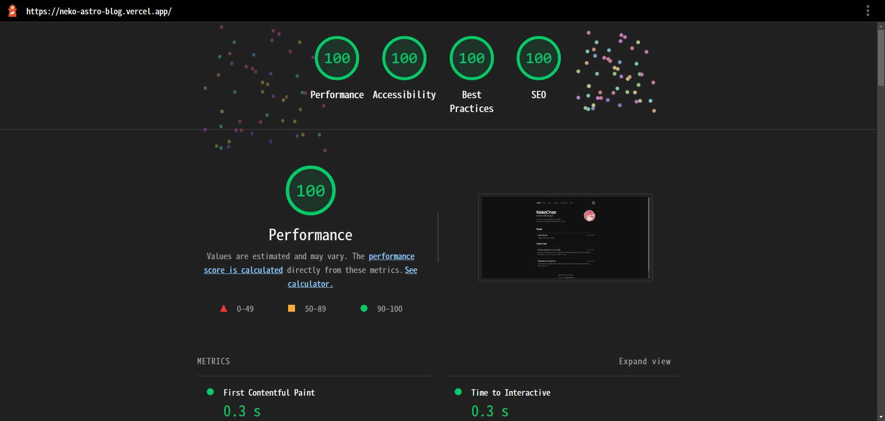

# Astro Blog

<p align="center">
  
  <br/><br/>
  A Fast, Small & Powerful Blog Template For Developer.
  <br/><br/>
  Inspired by <a href="https://leerob.io/">leerob.io</a>
  <br/><br/>
  Demo <a href="https://neko-astro-blog.vercel.app/">neko-astro-blog.vercel.app/</a>
</p>

## ⭐ Features

- Fast & Small 🏎️

  - Static site generation
  - Auto-compress all static files
  - Built with [Astro](https://astro.build/), [Solid.js](https://www.solidjs.com/) and [Tailwind CSS](https://tailwindcss.com/)
  - Image optimized (local/remote images auto compress to `Webp` format) with lazy loading
  - Partial hydration

- Powerful 🚀

  - MDX support
  - Syntax highlighting
    - copy button
    - line number
    - line highlight
    - dark mode
  - Twemoji support
  - Comments system
  - SEO friendly
  - RSS feed

- Responsive 📱

  - Mobile-first
  - Dark mode
  - Customizable

## 📂 Project Structure

```
astro-blog
├─ site.config.ts
├─ astro.config.ts
├─ tailwind.config.cjs
├─ postcss.config.cjs
├─ prettier.config.cjs
├─ public
│  └─ favicon.svg
├─ src
│  ├─ assets
│  ├─ components
│  │  └─ MDX
│  ├─ images
│  ├─ layouts
│  ├─ lib
│  ├─ pages
│  │  ├─ index.astro
│  │  ├─ blog.astro
│  │  ├─ blog
│  │  │  ├─ _frontmatter.yaml
│  │  │  └─ _template.mdx
│  │  ├─ tags
│  │  │  ├─ index.astro
│  │  │  └─ [tag].astro
│  │  ├─ snippets.astro
│  │  ├─ snippets
│  │  │  ├─ _frontmatter.yaml
│  │  │  └─ _template.mdx
│  │  ├─ guestbook.astro
│  │  ├─ 404.astro
│  │  └─ rss.xml.ts
│  ├─ plugins
│  ├─ styles
│  ├─ types
│  ├─ _autoimports.ts
│  └─ _components.ts
└─ package.json

```

## 🧞 Commands

| Command        | Action                                       |
| :------------- | :------------------------------------------- |
| `pnpm i`       | Installs dependencies                        |
| `pnpm dev`     | Starts local dev server at `localhost:3000`  |
| `pnpm build`   | Build your production site to `./dist/`      |
| `pnpm preview` | Preview your build locally, before deploying |
| `pnpm update`  | Update all the dependencies to latest        |
| `pnpm format`  | Format project with Prettier                 |
